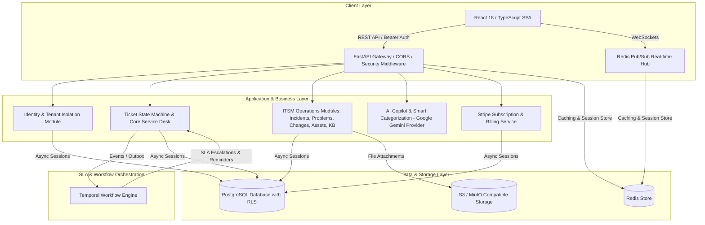

# 🛡️ ResolveHub — Multi-Tenant Enterprise ITSM & Operations Platform

ResolveHub is a production-ready, multi-tenant IT Service Management (ITSM) and operations platform built with **Python 3.12, FastAPI, Async SQLAlchemy 2, PostgreSQL, Redis, Temporal SLA Workflows, Google Gemini AI, and a modern React 18 / TypeScript frontend**.

---

## 🎯 Purpose & Why ResolveHub Matters

### **The Problem It Solves**
Modern enterprises and IT operations teams face fragmented tools: ticketing in one tool, incident response in another, asset tracking in spreadsheets, and SLA monitoring managed manually. This leads to missed SLAs, uncoordinated outages, high mean-time-to-resolution (MTTR), and lack of audit visibility.

### **How ResolveHub Helps Organizations**
ResolveHub unifies all core ITSM disciplines into a single multi-tenant SaaS platform:

- **Reduces MTTR (Mean Time To Resolution)**: AI Copilot automatically categorizes tickets, suggests solutions from the Knowledge Base, and identifies root causes.
- **Prevents SLA Breaches**: Temporal-backed background workflows monitor ticket resolution windows in real time and trigger automatic escalations before breaches occur.
- **Ensures Enterprise Security & Isolation**: Native multi-tenant isolation enforces strict `organisation_id` scoping at every API route and database query with PostgreSQL Row-Level Security (RLS).
- **Streamlines IT Operations**: Out-of-the-box support for Incidents (P1–P4), Problems (RCA), Changes (CAB), IT Assets (ITAM), and Knowledge Base (KB).
- **Monetization & SaaS Ready**: Built-in Stripe subscription system with automatic billing portal, checkout sessions, and tier management (Starter, Professional Enterprise, Custom Enterprise).

---

## 🏗️ System Architecture

ResolveHub is structured as a **modular FastAPI monolith** designed for maximum maintainability, high performance async I/O, and linear horizontal scalability.



---

## ✨ Key Features Breakdown

### 1. 🏢 Multi-Tenant Security & RBAC
- Explicit tenant scoping via `organisation_id` on every database record.
- Role-Based Access Control (Admin, Agent, Requester) verified in route dependencies.
- Token family refresh rotation, Argon2id password hashing, and CSRF protection.

### 2. 🚨 IT Service Management (ITSM) Modules
- **Service Desk**: Ticket lifecycle state machine (`New` ➔ `In Progress` ➔ `Pending` ➔ `Resolved` ➔ `Closed`).
- **Incidents**: Major outage command center, severity tracking (P1 Critical – P4 Low), and timeline logging.
- **Problems**: Root Cause Analysis (RCA), Known Errors Database (KEDB), and workaround documentation.
- **Changes**: Change Advisory Board (CAB) reviews, risk assessments, and maintenance window scheduling.
- **Assets**: IT Asset Management (ITAM) hardware/software tracking, serial numbers, and assignments.
- **Knowledge Base**: Markdown article repository with AI auto-generation and view counters.

### 3. 🤖 AI Copilot & Smart Categorization
- Integrated with **Google Gemini API** (`RH_AI_PROVIDER=gemini`).
- Automatic ticket triage, priority scoring, duplicate detection, and solution recommendations.

### 4. ⏱️ Temporal SLA Workflows
- Automated resolution timers tailored by ticket priority.
- Proactive notifications and auto-escalation before SLA breach windows expire.

### 5. 💳 Stripe Subscription Billing
- Production-grade Stripe SDK integration.
- Automated Checkout Sessions (`checkout.stripe.com`) and Customer Billing Portal (`billing.stripe.com`).
- Support for Starter ($0/mo), Professional Enterprise ($49/mo), and Custom Enterprise plans.

---

## 🛠️ Technology Stack

- **Backend**: Python 3.12, FastAPI, Pydantic v2, Async SQLAlchemy 2, Alembic, PostgreSQL, Redis, Temporal.
- **Frontend**: React 18, TypeScript, Vite, React Query, Lucide Icons, Vanilla CSS Variables Design System.
- **Integrations**: Stripe API, Google Gemini API, S3/MinIO Storage.

---

## ⚙️ Local Setup & Installation

### Prerequisites
- Python 3.12+
- Node.js 18+
- PostgreSQL 14+
- Redis 7+

### 1. Backend Setup

```bash
# 1. Clone repository
git clone https://github.com/Kocherlasuhith12/resolve-hub.git
cd resolve-hub

# 2. Configure environment variables
cp .env.example .env

# 3. Create virtual environment & install dependencies
python3.12 -m venv .venv
source .venv/bin/activate
pip install -r requirements.txt

# 4. Run database migrations
alembic upgrade head

# 5. Seed demo data (Acme Corp with demo tickets, incidents, assets, KB)
PYTHONPATH=. python -m resolvehub.scripts.seed_demo_data

# 6. Start FastAPI backend server
uvicorn resolvehub.app.main:app --port 8000 --reload
```

### 2. Frontend Setup

In a new terminal window:

```bash
cd frontend
npm install
npm run dev
```

- **Frontend App**: `http://localhost:5173`
- **FastAPI API Docs**: `http://localhost:8000/docs`
- **Backend Health Check**: `http://localhost:8000/api/v1/health`

---

## 🔑 Demo Account Credentials

| Role | Email | Password | Access Level |
|---|---|---|---|
| **Admin** | `admin@acme.example.com` | `DemoPassword123!` | Full Workspace Management & Settings |
| **Agent** | `agent@acme.example.com` | `DemoPassword123!` | Ticket Resolution, Incidents & Assets |
| **Requester** | `requester@acme.example.com` | `DemoPassword123!` | Ticket Submission & Knowledge Base |

---

## 🧪 Quality & Verification Suite

```bash
# Backend pytest suite (58 tests)
.venv/bin/pytest

# Backend linting & code formatting
.venv/bin/ruff check resolvehub/ tests/

# Frontend TypeScript compilation & production build
cd frontend
npm run build

# Frontend Vitest suite (7 tests)
npm test
```

---

## 📄 License & Delivery Progress

See [docs/progress.md](docs/progress.md) for full phase-by-phase delivery status, architectural evidence reports, and milestone details.
