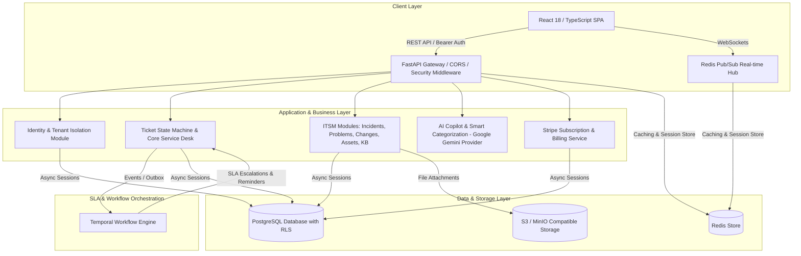

<div align="center">

# 🛡️ ResolveHub

### Multi-Tenant Enterprise ITSM & Operations Platform

**Unify service desk, incident management, problem management, change control, asset tracking, and knowledge management — with AI-powered triage and real-time SLA enforcement.**

[](https://www.python.org/)
[](https://fastapi.tiangolo.com/)
[](https://react.dev/)
[](https://www.typescriptlang.org/)
[](https://www.postgresql.org/)
[](https://temporal.io/)
[](docs/progress.md)

### 🚀 Live Production Deployment

| Service | Live URL | Status |
| :--- | :--- | :---: |
| ⚛️ **Live Web Application (Frontend)** | [**resolvehub-frontend-suhith.onrender.com**](https://resolvehub-frontend-suhith.onrender.com) | **`LIVE`** 🟢 |
| 🐍 **Live REST API (FastAPI Backend)** | [**resolvehub-api-suhith.onrender.com**](https://resolvehub-api-suhith.onrender.com) | **`LIVE`** 🟢 |
| 📚 **Live API Swagger Documentation** | [**resolvehub-api-suhith.onrender.com/docs**](https://resolvehub-api-suhith.onrender.com/docs) | **`LIVE`** 🟢 |
| 💚 **Live Backend Health Check** | [**resolvehub-api-suhith.onrender.com/health/live**](https://resolvehub-api-suhith.onrender.com/health/live) | **`LIVE`** 🟢 |

[Overview](#-overview) • [Architecture](#-system-architecture) • [Features](#-key-features) • [Tech Stack](#-technology-stack) • [Setup](#-local-setup--installation) • [Testing](#-quality--verification-suite) • [Roadmap](#-roadmap--delivery-status)

</div>

---

## 📌 Overview

ResolveHub is a production-ready, multi-tenant **IT Service Management (ITSM)** and operations platform built on **Python 3.12, FastAPI, Async SQLAlchemy 2, PostgreSQL, Redis, Temporal, Google Gemini AI**, and a **React 18 / TypeScript** frontend.

### The Problem

Enterprises and IT operations teams routinely struggle with fragmented tooling — ticketing in one system, incident response in another, assets tracked in spreadsheets, and SLAs monitored by hand. The result is missed SLAs, uncoordinated outages, elevated **Mean Time To Resolution (MTTR)**, and little to no audit visibility.

### The Solution

ResolveHub consolidates the core ITSM disciplines into a single, secure, multi-tenant SaaS platform:

| Capability | How ResolveHub Delivers It |
|---|---|
| **Reduce MTTR** | AI Copilot auto-categorizes tickets, surfaces Knowledge Base solutions, and highlights likely root causes. |
| **Prevent SLA Breaches** | Temporal-backed background workflows monitor resolution windows in real time and auto-escalate before breach. |
| **Enterprise-Grade Isolation** | Strict `organisation_id` scoping on every API route and query, enforced with PostgreSQL Row-Level Security (RLS). |
| **Unified Operations** | Out-of-the-box Incidents (P1–P4), Problems (RCA), Changes (CAB), IT Assets (ITAM), and Knowledge Base (KB). |
| **SaaS-Ready Monetization** | Native Stripe subscription billing with checkout sessions, billing portal, and tiered plans. |

---

## 🏗️ System Architecture

ResolveHub is a **modular FastAPI monolith**, designed for maintainability, high-throughput async I/O, and linear horizontal scalability.



---

## ✨ Key Features

### 1. 🏢 Multi-Tenant Security & RBAC
- Explicit tenant scoping via `organisation_id` on every database record
- Role-Based Access Control (**Admin**, **Agent**, **Requester**) enforced at the route-dependency level
- Token-family refresh rotation, Argon2id password hashing, and CSRF protection

### 2. 🚨 ITSM Modules
- **Service Desk** — full ticket lifecycle state machine: `New → In Progress → Pending → Resolved → Closed`
- **Incidents** — major outage command center with severity tracking (P1 Critical – P4 Low) and timeline logging
- **Problems** — Root Cause Analysis (RCA), Known Errors Database (KEDB), workaround documentation
- **Changes** — Change Advisory Board (CAB) reviews, risk assessments, maintenance window scheduling
- **Assets** — IT Asset Management (ITAM): hardware/software tracking, serial numbers, assignments
- **Knowledge Base** — Markdown article repository with AI auto-generation and view counters

### 3. 🤖 AI Copilot & Smart Categorization
- Integrated with the **Google Gemini API** (`RH_AI_PROVIDER=gemini`)
- Automatic ticket triage, priority scoring, duplicate detection, and solution recommendations

### 4. ⏱️ Temporal SLA Workflows
- Resolution timers automatically tailored to ticket priority
- Proactive notifications and auto-escalation ahead of SLA breach windows

### 5. 💳 Stripe Subscription Billing
- Production-grade Stripe SDK integration
- Automated Checkout Sessions and Customer Billing Portal
- Tiered plans: **Starter** ($0/mo) · **Professional Enterprise** ($49/mo) · **Custom Enterprise**

---

## 🛠️ Technology Stack

| Layer | Technologies |
|---|---|
| **Backend** | Python 3.12 · FastAPI · Pydantic v2 · Async SQLAlchemy 2 · Alembic · PostgreSQL · Redis · Temporal |
| **Frontend** | React 18 · TypeScript · Vite · React Query · Lucide Icons · CSS Variables Design System |
| **Integrations** | Stripe API · Google Gemini API · S3 / MinIO Storage |

---

## ⚙️ Local Setup & Installation

### Prerequisites
- Python 3.12+
- Node.js 18+
- PostgreSQL 14+
- Redis 7+

### 1. Backend Setup

```bash
# 1. Clone the repository
git clone https://github.com/Kocherlasuhith12/resolve-hub.git
cd resolve-hub

# 2. Configure environment variables
cp .env.example .env

# 3. Create a virtual environment & install dependencies
python3.12 -m venv .venv
source .venv/bin/activate
pip install -r requirements.txt

# 4. Run database migrations
alembic upgrade head

# 5. Seed demo data (Acme Corp with demo tickets, incidents, assets, KB)
PYTHONPATH=. python -m resolvehub.scripts.seed_demo_data

# 6. Start the FastAPI backend server
uvicorn resolvehub.app.main:app --port 8000 --reload
```

### 2. Frontend Setup

In a new terminal window:

```bash
cd frontend
npm install
npm run dev
```

| Service | URL |
|---|---|
| Frontend App | `http://localhost:5173` |
| FastAPI API Docs (Swagger) | `http://localhost:8000/docs` |
| Backend Health Check | `http://localhost:8000/api/v1/health` |

---

## 🔑 Demo Account Credentials

> ⚠️ These credentials are for local demo/evaluation environments only. Rotate or disable them before any production deployment.

| Role | Email | Password | Access Level |
|---|---|---|---|
| **Admin** | `admin@acme.example.com` | `DemoPassword123!` | Full workspace management & settings |
| **Agent** | `agent@acme.example.com` | `DemoPassword123!` | Ticket resolution, incidents & assets |
| **Requester** | `requester@acme.example.com` | `DemoPassword123!` | Ticket submission & knowledge base |

---

## 🧪 Quality & Verification Suite

```bash
# Backend pytest suite (58 tests)
.venv/bin/pytest

# Backend linting & code formatting
.venv/bin/ruff check resolvehub/ tests/

# Frontend TypeScript compilation & production build
cd frontend
npm run build

# Frontend Vitest suite (7 tests)
npm test
```

---

## 📄 Roadmap & Delivery Status

Full phase-by-phase delivery status, architectural evidence reports, and milestone details are tracked in [`docs/progress.md`](docs/progress.md).

---

<div align="center">

Built for IT operations teams who are done juggling five tools to do one job.

</div>
