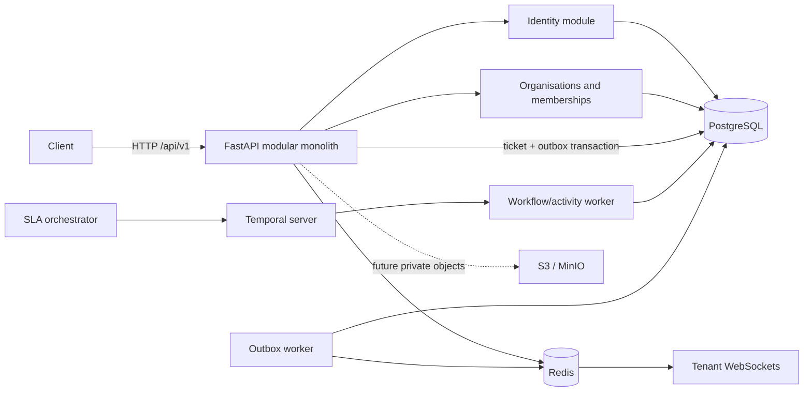
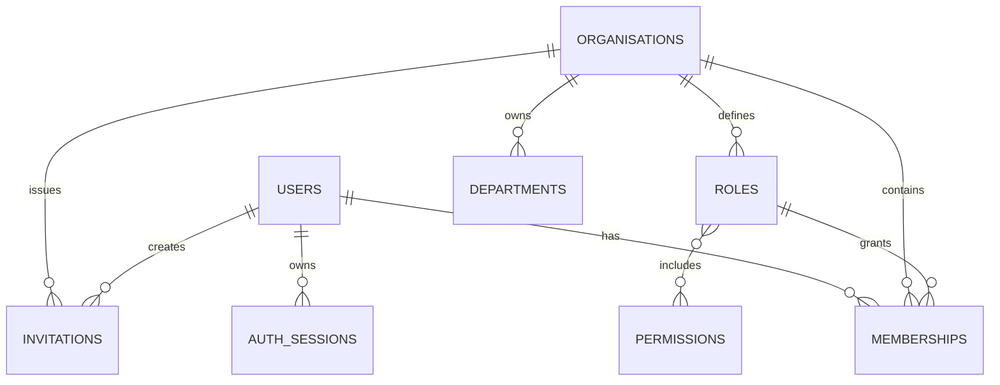
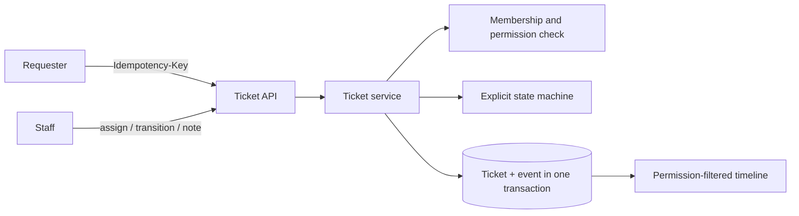

# Architecture overview

## Decision record: modular monolith first

ResolveHub starts as one deployable API and one database. Module boundaries preserve domain ownership without introducing network failure modes or distributed transactions prematurely. Durable workflow execution will be delegated to Temporal in Phase 3, while PostgreSQL remains the source of truth.

## Phase 1 boundaries

- `core` owns settings, database lifecycle, security primitives, errors, logging, middleware, and dependencies.
- `identity` owns users, credentials, verification, login, and sessions.
- `organisations` owns organisations, roles, memberships, invitations, departments, and tenant permission decisions.
- Route dependencies provide early rejection; services repeat material tenant/permission checks so alternate callers cannot bypass rules.

## Phase 1 entity relationships

All tenant resources contain `organisation_id`. Platform permissions have stable string codes; organisation roles map to them. Public IDs are UUIDs, timestamps are UTC, and uniqueness constraints prevent duplicate active membership and duplicate department names within a tenant.

## Phase 2 ticket core

Service categories route tickets to tenant-owned departments and supply default priority. Ticket create, assignment, transition, comment, note, and attachment-metadata operations append immutable events. Assignment and transition use row locks plus client-supplied versions. Requester reads are ownership-scoped unless the membership grants `ticket:read_all`; internal notes and their events require `internal_note:read`.

## Phase 3 workflow and delivery boundary

PostgreSQL remains the source of truth for SLA execution state and delivery intent. Ticket mutations append outbox rows in the same transaction. Separate workers claim those rows, create idempotent personal notifications, record provider attempts, and publish minimal messages to organisation-specific Redis channels.

Temporal owns durable waiting and retry semantics, not ticket data. The SLA orchestrator starts a stable workflow per tenant/ticket and converts persisted pause/resume/complete states into workflow signals. Warning and breach activities re-enter the application service boundary, lock tenant-qualified records, deduplicate immutable events, and enqueue their notifications transactionally.

WebSocket authentication validates a short-lived token against the current database session and membership before subscribing to a tenant channel. Recipient IDs and staff visibility are filtered again before sending; URLs never contain access tokens.

## Security decisions and risks

Argon2id hashes passwords. JWT access tokens are short-lived and contain user/session identifiers, never permissions. Every request resolves current database state, so account or session revocation takes effect immediately. Refresh tokens are opaque random values; only hashes are stored, rotation is transactional, and reuse revokes the family. Verification and invitation responses are enumeration-resistant outside local development.

Highest risks are missing tenant predicates, refresh races, proxy-aware client identity for rate limiting, and eventual inconsistency in outbound notifications. Cross-tenant tests, row locks during refresh, trusted-proxy deployment configuration, and a future transactional outbox respectively mitigate them.
